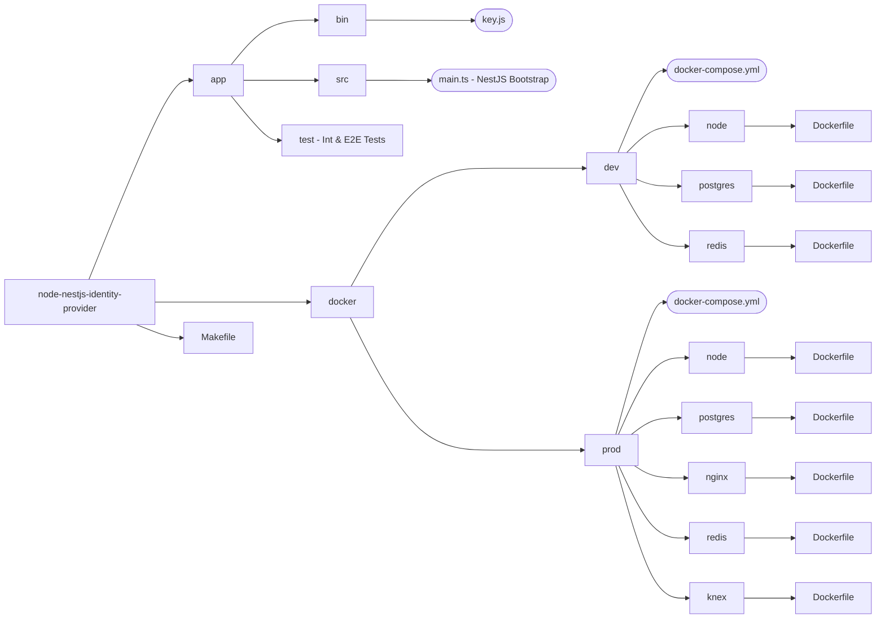
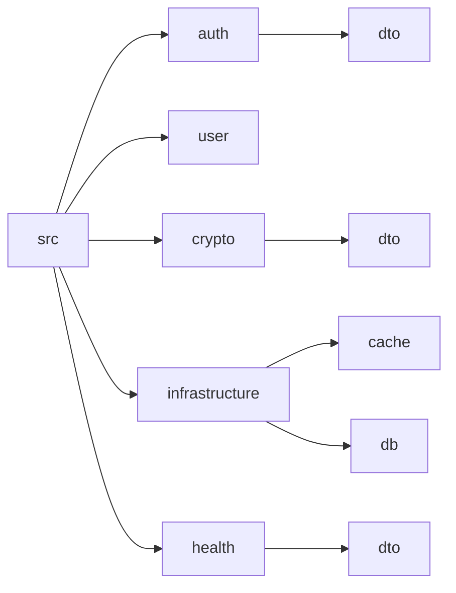

# NestJS OAuth 2.1


This project intended as a production ready application for OAuth 2.1 implementation using NestJS.

<p align="center">
  <a href="https://syniol.com/" target="blank"></a>
</p>


## Component Architecture
<p align="center">
  <a href="https://syniol.com/" target="blank"></a>
</p>

## Solution Architecture
<p align="center">
  <a href="https://syniol.com/" target="blank"></a>
</p>


## Software Architecture
It uses a Modular, Hexagon, Component-based Architecture, and it utilises Rich-Domain Design. 
In cases where bounded context extended to two or more components, component are imported as 
required. One of major component is `infrastructure`, by importing this component, you will 
import all APIs and connections for __Postgres__ and __Redis__. However, you could also just 
import `CacheModule` or `DatabaseModule` individually.


### Structure
Diagram below shows root structure of the project.


In this diagram you can see the structure of NestJS application and the modules



## Production Deployment
You need to have a docker installation on the host machine (VPS, Dedicated Server, 
Cloud Private Computing). For an Ubuntu distros you can run `docker.sh` at the 
root of `docker` folder. Please see an example below running the command.

```bash
./docker/docker.sh
```

when installation is complete, simply clone this repository on the remote host.

### SSL and NGINX Configuration
There an SSL configuration inside the NGINX `conf` file but is commented out. This file 
is copied during built inside the NGINX Docker image, and it could be found 
at: `/docker/prod/nginx/nginx.conf`.

```editorconfig
#         listen 443 ssl;
#         server_name *.syniol.com;
#         ssl_certificate       /usr/.ssl/fullchain.pem;
#         ssl_certificate_key   /usr/.ssl/privkey.pem;
```

### SSL with Certbot
You could set up your certificates with a Free and recognised SSL 
authority Certbot.

__Verification running on a remote host:__
```bash
# Verification Server for Certbot
docker run --rm --name cert-http-server \
-v "$(pwd)":/usr/share/nginx/html:ro \
-p 80:80 \
-d nginx:latest
```

__Producing Certificates for NGINX__
```bash
# TLS Cert for NGINX
docker run -it --rm --name certbot \
-v "/etc/letsencrypt:/etc/letsencrypt" \
-v "/var/lib/letsencrypt:/var/lib/letsencrypt" \
certbot/certbot certonly -a manual -i nginx -d api.yourdomain.com
```

When process is complete, you will need to copy generated certificate two files 
inside the NGINX docker image located at: `docker/prod/nginx/`
 * __fullchain.pem__
 * __privkey.pem__

> You could also ignore SSL configuration step and always serve on port 80 (http)


### Secret Manager
You should populate create and populate `docker/prod/.env` from given template `docker/prod/.env.dist`. 
You could use any secret manager you have in your toolbox. This repository doesn't enforce or opinionated 
for your operation toolkit.

#### Encryption Key
There is a CLI node.js application located at: `app/bin/key.js` that creates a secret key
could be utilised to decrypt and encryption of passwords. Environment variable
`CRYPTO_SECRET_KEY` is populated via host or `.env` file at the root of docker files. This 
will differ for each environment. You could generate a new shared key and modify the exiting 
key located at: `docker/prod/.env`.

#### Database Credential <sup>Zero Trust Security</sup>
Postgres database is not exposed outside of private network for zero trust security. However, 
in order to access the database within the secure network and container you need to define a 
password inside `docker/prod/.env` via your chosen secret manager `POSTGRES_PASSWORD`.


### Up and Running with Docker
It's simple, just run `make && make up`. This will build docker images necessary
to run the app and spins up the containers. Please look at `Makefile` to see all 
available commands.


## Health Check
Health check endpoint should always return http status code `200` _OK_. This is
used inside docker-compose for determination of status of container.

```bash
curl -X GET http://127.0.0.1/healthz
```


## Authentication
Following __RFC-6749__ standard for OAuth 2.1 for `grant_type=password`, created an endpoint
to request a token to access auth guarded endpoints utilising `AuthGuard`.

__Request Example:__
```bash
curl -d "username=guest&password=Guest123456&grant_type=password" \
 -H "Content-Type: application/x-www-form-urlencoded" \
  -X POST http://127.0.0.1/auth/token
```

__Response Example:__
```json
{
  "access_token": "wLLGQxn5CpUd4Kx0tnM5qrxTgoZyLd8LnqvE8ZkaVHPVeFQF/iuMYuvQu1QGPk9qRj91vqc1JzDZHOlCFV8NhQ==",
  "expires_in": 3600,
  "refresh_token": "E/hi7cQ4La/TZwwk33VXHbCqaSc3cZx0FGxsamgdCOli4+uAXAsezWMo+NrPTCcwujlwqqszik7r/qmXJzPJoA==",
  "scope": "portal.readonly",
  "token_type": "Bearer"
}
```


## Database & ORM
Due to capability of Postgres database for serving both document based and relational. I
picked Postgres and `Knex.js` as database and SQL query builder, database migration, and
data seeder.

__Knex.js Useful Commands:__
```bash
npm install nestjs-knex knex pq --save

npx knex init -x ts

npx knex migrate:make <migration_name> -x ts
npx knex migrate:latest

npx knex seed:make <seed_name> -x ts
npx knex seed:run
```

## Data Transfer Objects (DTO) Validation
In order to validate the incoming requests we use Zod and its extension for NestJS. Please [read more here](https://www.npmjs.com/package/nestjs-zod).

```bash
npm i nestjs-zod zod
```


### Credits
<small>Author: [Hadi Tajallaei](mailto:hadi@syniol.com)</small>
<p><small>Copyright &copy; 2026 Syniol Limited. All rights reserved.</small></p>
